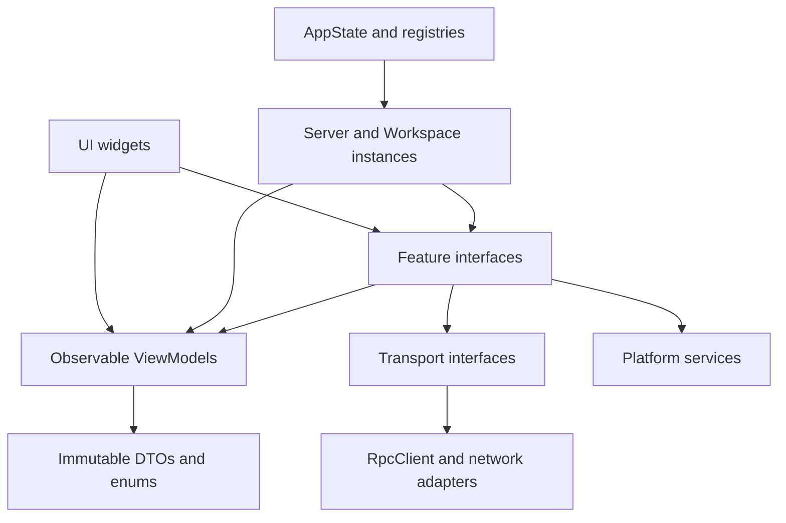

# Workspace-first Observable architecture

> Status: implemented. This document describes the current Flutter state and
> runtime boundaries after the workspace-first migration.

本文定义 Flutter 应用当前的 Workspace-first 架构。核心原则是：

- 一个 `ServerInstance` 对应一个已配置的 motifd Server。
- 一个 `WorkspaceInstance` 对应一个确定的 `(serverId, session)`。
- 所有可被 UI 或协调器读取的数据都属于 Observable ViewModel 树。
- RPC、Timer、Tunnel、Forwarder、Subscription 等资源不进入状态树。
- UI 读取 ViewModel，通过 Controller/Service 发出命令。
- ViewModel 只向下组合，不依赖 Controller、Service、Registry 或 AppState。

物理文件边界同样遵守这个方向：`TailscaleViewModel`、
`DeviceRegistrationViewModel`、`RemotePortsViewModel` 分别位于独立的
`*_view_model.dart` 文件；对应 Service/Controller 只向它们写入状态。ViewModel
文件不 import Controller、Service、网络实现或平台实现。

## 1. Runtime hierarchy

```text
AppState (application coordinator)
├── PlatformServices
│   ├── TailscaleService
│   └── EmbeddedServerService?
│
├── ServerInstance registry
│   └── ServerInstance(serverId)
│       ├── ServerTransport
│       ├── ServerAccessController
│       ├── SessionCatalogController
│       ├── DeviceController
│       └── unattached WorkspaceApi
│
└── WorkspaceRegistry
    ├── WorkspaceInstance(serverId, session-a)
    ├── WorkspaceInstance(serverId, session-b)
    └── WorkspaceInstance(serverId, session-c)
```

`WorkspaceInstance` 是生命周期和资源所有者，不是改名后的 Client。它只持有组件引用和统一 `dispose`，不提供 `connect`、`createPty`、`openView`、`fsRead` 等转发方法。

```dart
final class WorkspaceInstance {
  WorkspaceInstance({
    required this.key,
    required this.viewModel,
    required this.connection,
    required this.lifecycle,
    required this.attachment,
    required this.terminal,
    required this.views,
    required this.remotePorts,
    required this.workspace,
  });

  final WorkspaceKey key;
  final WorkspaceViewModel viewModel;
  final WorkspaceConnectionController connection;
  final WorkspaceLifecycleController lifecycle;
  final SessionAttachment attachment;
  final TerminalController terminal;
  final ViewController views;
  final RemotePortController remotePorts;
  final WorkspaceApi workspace;

  Future<void> close();
  void dispose();
}
```

`WorkspaceConnectionController` 只拥有一个固定 session 的 RPC/attachment
生命周期，并在 `session.attach` 返回聚合 snapshot 时协调 focused controllers。
它不再暴露 Terminal、View、File、Git、RemotePort、Session catalog 或 Device
命令的转发方法。

Feature 不能 import `WorkspaceInstance`。它只是 composition root，由 `AppState` 和 `WorkspaceRegistry` 管理，不直接传给 UI。

### 1.1 State 源码目录

`lib/motif/state` 按“状态归属域优先、Workspace Feature 其次”组织：

```text
state/
├── app/                    应用组合根、进程级 UI 状态与 Scope
├── connection/             跨 Server/Workspace 共享的连接值对象
├── embedded/               Embedded motifd 的模型、服务与 ViewModel
├── persistence/            Store、序列化和偏好 ViewModel
├── platform/               平台能力的 Observable projection
├── server/                 Server access、session catalog、device、push、transport
└── workspace/              Workspace 组合、生命周期、content、presence
    ├── connection/         固定 session 的 transport、attach 与 snapshot 协调
    ├── terminal/           PTY 状态、运行策略与字节输出
    ├── view/               View/tab 状态与命令
    └── remote_port/        Remote port 状态与 forwarding
```

分类依据是“谁拥有它的生命周期”，而不是简单按 `model/controller/service`
技术类型分桶。Controller 与它写入的 ViewModel、所用的 focused transport
contract 放在同一个领域目录；生成的 `.g.dart` 与源文件同目录。新增文件必须进入
最窄的归属域，不在 `state` 下新增 `common`、`models`、`controllers`、`utils`
这类会持续膨胀的通用目录。

目录依赖保持由外向内：`app` 是最外层组合根；Server/Workspace coordinator
负责组装 focused feature；`terminal`、`view`、`remote_port` 这些叶子 Feature
不依赖 `app`、Instance 或彼此。`workspace/connection` 是明确的 attach
协调边界，可以在 snapshot 恢复时组装这些 focused feature，但叶子 Feature
不会反向依赖它。

## 2. State ownership

状态按三个层级归属。

### 2.1 Process-wide state

进程级状态不属于任何 Server 或 Session：

- App shell 与生命周期。
- Terminal、Quick Command、Push 等全局偏好。
- Tailscale backend 状态。
- 本机 Embedded Server 状态。

Tailscale backend 是全局唯一能力。每个 Tailscale Server 可以计算自己的 access projection，但不能复制一份独立的 Tailscale backend state。

### 2.2 Server state

一个 Server 的状态与具体 Session 无关：

- Server profile。
- Direct/Tailscale/SSH/WSL/Rendezvous access 状态。
- SSH/WSL bootstrap 的可展示结果。
- Rendezvous relay/direct resolution 的可展示结果。
- Session catalog。
- Push device registration。
- Active/warm workspace index。

### 2.3 Workspace state

一个 Workspace 严格对应：

```dart
typedef WorkspaceKey = ({String serverId, String session});
```

它拥有：

- 到确定 Session 的连接与 attachment projection。
- PTY、command 和 shell integration 状态。
- Views 和 active view。
- Session clients 与 theme。
- Files/Git invalidation versions。
- Remote port mapping projection。
- 离线 Terminal/View snapshot。

Session 已经包含在 identity 中，因此目标架构不再需要：

```text
intendedSession
prepareSessionSwitch
prepareSessionReconnect
```

切换 Session 等于切换 `WorkspaceInstance`。

## 3. Observable ViewModel tree

```text
AppViewModel
├── shell: AppShellViewModel
│   ├── viewMode
│   ├── lifecycle
│   ├── pendingSessionOpen
│   └── sidebar: SessionSidebarViewModel
│       ├── showSessions
│       ├── showFileTree
│       ├── showGitDiff
│       ├── showBottomBar
│       ├── width
│       └── split fractions
│
├── preferences: PreferencesViewModel
│   ├── terminal: TerminalPreferencesViewModel
│   ├── quickCommands: QuickCommandViewModel
│   └── push: PushPreferencesViewModel
│
├── platform: PlatformViewModel
│   ├── tailscale: TailscaleViewModel
│   │   ├── status
│   │   ├── authUrl
│   │   ├── detail
│   │   ├── discovering
│   │   ├── peers
│   │   └── error
│   │
│   └── embeddedServer: EmbeddedServerViewModel?
│       ├── available
│       ├── config
│       └── status
│
└── servers: ServerRegistryViewModel
    ├── activeServerId
    ├── order: ObservableList<String>
    └── entries: ObservableMap<String, ServerViewModel>
        │
        └── ServerViewModel
            ├── profile
            ├── access: ServerAccessViewModel
            ├── sessions: SessionCatalogViewModel
            ├── device: DeviceRegistrationViewModel
            └── workspaces: WorkspaceRegistryViewModel
                ├── activeSession
                ├── warmOrder
                └── retained: ObservableMap<String, WorkspaceViewModel>
                    │
                    └── WorkspaceViewModel
                        ├── serverId
                        ├── session
                        ├── connection: WorkspaceConnectionViewModel
                        ├── terminal: TerminalViewModel
                        ├── views: ViewTabsViewModel
                        ├── remotePorts: RemotePortsViewModel
                        ├── content: WorkspaceContentViewModel
                        └── presence: WorkspacePresenceViewModel
                            ├── clients: ObservableList<ClientInfo>
                            ├── sessionTheme
                            └── latestNotification
```

## 4. ViewModel definitions

以下代码用于定义属性边界；最终实现可以按文件拆分，但不能改变所有权方向。

### 4.1 AppViewModel

```dart
@ObservableModel()
class AppViewModel extends _$AppViewModel {
  AppViewModel({
    @ObservationReadOnly() required AppShellViewModel shell,
    @ObservationReadOnly() required PreferencesViewModel preferences,
    @ObservationReadOnly() required PlatformViewModel platform,
    @ObservationReadOnly() required ServerRegistryViewModel servers,
  }) : super(shell, preferences, platform, servers);
}
```

根 ViewModel 只组合固定 identity 的子 ViewModel。子对象引用使用 `@ObservationReadOnly`，运行期间不替换整棵子树。

### 4.2 AppShellViewModel

```dart
enum AppLifecyclePhase { foreground, background }

@ObservableModel()
class AppShellViewModel extends _$AppShellViewModel {
  AppShellViewModel({
    AppViewMode viewMode = AppViewMode.client,
    AppLifecyclePhase lifecycle = AppLifecyclePhase.foreground,
    PendingSessionOpen? pendingSessionOpen,
    @ObservationReadOnly() required SessionSidebarViewModel sidebar,
  }) : super(viewMode, lifecycle, pendingSessionOpen, sidebar);
}
```

一次性事件协调，例如 close-shortcut consumed flag，不进入长期状态树。

### 4.3 PreferencesViewModel

```dart
@ObservableModel()
class PreferencesViewModel extends _$PreferencesViewModel {
  PreferencesViewModel({
    @ObservationReadOnly()
    required TerminalPreferencesViewModel terminal,
    @ObservationReadOnly()
    required QuickCommandViewModel quickCommands,
    @ObservationReadOnly()
    required PushPreferencesViewModel push,
  }) : super(terminal, quickCommands, push);
}
```

```dart
@ObservableModel()
class TerminalPreferencesViewModel
    extends _$TerminalPreferencesViewModel {
  TerminalPreferencesViewModel({
    TerminalSettings settings = const TerminalSettings(),
  }) : super(settings);
}
```

```dart
@ObservableModel()
class QuickCommandViewModel extends _$QuickCommandViewModel {
  QuickCommandViewModel({
    @ObservationReadOnly()
    required ObservableList<QuickCommand> commands,
    @ObservationReadOnly()
    required ObservableList<QuickCommandSet> sets,
  }) : super(commands, sets);
}
```

```dart
@ObservableModel()
class PushPreferencesViewModel extends _$PushPreferencesViewModel {
  PushPreferencesViewModel({
    bool enabled = true,
    @ObservationReadOnly()
    required ObservableSet<String> mutedSessions,
  }) : super(enabled, mutedSessions);
}
```

Persistence 负责 DTO、JSON、SharedPreferences 和 SecretStore。ViewModel 只保存当前内存投影。

### 4.4 PlatformViewModel

```dart
@ObservableModel()
class PlatformViewModel extends _$PlatformViewModel {
  PlatformViewModel({
    @ObservationReadOnly() required TailscaleViewModel tailscale,
    @ObservationReadOnly()
    required EmbeddedServerViewModel? embeddedServer,
  }) : super(tailscale, embeddedServer);
}
```

```dart
@ObservableModel()
class TailscaleViewModel extends _$TailscaleViewModel {
  TailscaleViewModel({
    TailscaleStatus status = TailscaleStatus.stopped,
    String? authUrl,
    String? detail,
    bool discovering = false,
    @ObservationReadOnly()
    required ObservableList<TailscalePeer> peers,
    String? error,
  }) : super(status, authUrl, detail, discovering, peers, error);

  bool get isRunning => status == TailscaleStatus.running;
}
```

`TailscaleService` 暴露同一个 `viewModel`，只负责 start、stop、resolve、discover 等行为。

### 4.5 ServerRegistryViewModel

```dart
@ObservableModel()
class ServerRegistryViewModel extends _$ServerRegistryViewModel {
  ServerRegistryViewModel({
    String? activeServerId,
    @ObservationReadOnly() required ObservableList<String> order,
    @ObservationReadOnly()
    required ObservableMap<String, ServerViewModel> entries,
  }) : super(activeServerId, order, entries);

  ServerViewModel? get active =>
      activeServerId == null ? null : entries[activeServerId];
}
```

`order` 是唯一顺序来源；不能依赖 Map iteration order。

### 4.6 ServerViewModel

```dart
@ObservableModel()
class ServerViewModel extends _$ServerViewModel {
  ServerViewModel({
    required MotifServer profile,
    @ObservationReadOnly() required ServerAccessViewModel access,
    @ObservationReadOnly() required SessionCatalogViewModel sessions,
    @ObservationReadOnly()
    required DeviceRegistrationViewModel device,
    @ObservationReadOnly()
    required WorkspaceRegistryViewModel workspaces,
  }) : super(profile, access, sessions, device, workspaces);

  String get id => profile.id;
  ServerKind get kind => profile.kind;
}
```

`profile` 是可持久化 DTO 的 observable snapshot。修改配置时替换 DTO；序列化逻辑不进入 ViewModel。

### 4.7 ServerAccessViewModel

```dart
enum ServerAccessPhase { idle, resolving, ready, blocked, failed }

@ObservableModel()
class ServerAccessViewModel extends _$ServerAccessViewModel {
  ServerAccessViewModel({
    ServerAccessPhase phase = ServerAccessPhase.idle,
    TransportViewState? transport,
    ConnectionBlocker? blocker,
    String? error,
    String? resolvedEndpoint,
  }) : super(phase, transport, blocker, error, resolvedEndpoint);

  bool get isReady => phase == ServerAccessPhase.ready;
}
```

归属该 ViewModel：

- Direct/Tailscale/SSH/WSL/Rendezvous access projection。
- SSH/WSL bootstrap 的可展示结果。
- Rendezvous relay/direct resolution 的可展示结果。
- 当前 Server 的 blocker、error 和 resolved endpoint。

不进入该 ViewModel：

- `ProxySettings` runtime instance。
- Certificate pin。
- SSH/Rendezvous forwarder handle。
- Socket、Timer 或 in-flight Future。

### 4.8 SessionCatalogViewModel

```dart
enum SessionCatalogPhase { idle, loading, ready, failed }

@ObservableModel()
class SessionCatalogViewModel extends _$SessionCatalogViewModel {
  SessionCatalogViewModel({
    SessionCatalogPhase phase = SessionCatalogPhase.idle,
    @ObservationReadOnly()
    required ObservableList<SessionInfo> sessions,
    String? error,
    DateTime? lastUpdatedAt,
  }) : super(phase, sessions, error, lastUpdatedAt);
}
```

Session catalog 是 Server state，不属于某个 Workspace。

### 4.9 WorkspaceRegistryViewModel

```dart
@ObservableModel()
class WorkspaceRegistryViewModel extends _$WorkspaceRegistryViewModel {
  WorkspaceRegistryViewModel({
    String? activeSession,
    @ObservationReadOnly()
    required ObservableList<String> warmOrder,
    @ObservationReadOnly()
    required ObservableMap<String, WorkspaceViewModel> retained,
  }) : super(activeSession, warmOrder, retained);

  WorkspaceViewModel? get active =>
      activeSession == null ? null : retained[activeSession];

  bool isWarm(String session) =>
      session != activeSession && retained.containsKey(session);
}
```

`activeSession` 和 `warmOrder` 只描述 registry membership；Workspace 自身不保存 active/warm flag，避免重复来源。

### 4.10 WorkspaceViewModel

```dart
@ObservableModel()
class WorkspaceViewModel extends _$WorkspaceViewModel {
  WorkspaceViewModel({
    @ObservationReadOnly() required String serverId,
    @ObservationReadOnly() required String session,
    @ObservationReadOnly()
    required WorkspaceConnectionViewModel connection,
    @ObservationReadOnly() required TerminalViewModel terminal,
    @ObservationReadOnly() required ViewTabsViewModel views,
    @ObservationReadOnly()
    required RemotePortsViewModel remotePorts,
    @ObservationReadOnly()
    required WorkspaceContentViewModel content,
    @ObservationReadOnly()
    required WorkspacePresenceViewModel presence,
  }) : super(
         serverId,
         session,
         connection,
         terminal,
         views,
         remotePorts,
         content,
         presence,
       );

  bool get hasSnapshot =>
      terminal.ptys.isNotEmpty || views.items.isNotEmpty;

  String? get activePtyId {
    final spec = views.active?.spec;
    return spec is PtyViewSpec ? spec.ptyId : null;
  }
}
```

### 4.11 WorkspaceConnectionViewModel

```dart
enum WorkspaceConnectionPhase {
  disconnected,
  connecting,
  ready,
  attaching,
  attached,
  reconnecting,
  suspended,
  failed,
}

@ObservableModel()
class WorkspaceConnectionViewModel
    extends _$WorkspaceConnectionViewModel {
  WorkspaceConnectionViewModel({
    WorkspaceConnectionPhase phase =
        WorkspaceConnectionPhase.disconnected,
    bool desiredConnected = false,
    bool transportAvailable = false,
    int reconnectAttempt = 0,
    String? message,
    ConnectionBlocker? blocker,
    String? attachedSession,
  }) : super(
         phase,
         desiredConnected,
         transportAvailable,
         reconnectAttempt,
         message,
         blocker,
         attachedSession,
       );

  bool get isAttached => phase == WorkspaceConnectionPhase.attached;
  bool get canInput => isAttached && transportAvailable;
}
```

`attachedSession` 是服务端已确认 attachment 的投影；Workspace identity 仍以父级
`WorkspaceViewModel.session` 为唯一目标 session，二者不能用于切换 identity。

### 4.12 TerminalViewModel

```dart
@ObservableModel()
class TerminalViewModel extends _$TerminalViewModel {
  TerminalViewModel({
    @ObservationReadOnly()
    required ObservableList<PtyInfo> ptys,
    @ObservationReadOnly()
    required ObservableMap<String, String> runningCommand,
    @ObservationReadOnly()
    required ObservableMap<String, ShellKind> shellKind,
    @ObservationReadOnly()
    required ObservableMap<String, ShellContext> shellContext,
  }) : super(ptys, runningCommand, shellKind, shellContext);
}
```

PTY bytes、replay buffer、surface sinks 和 `PtyOutputHub` 不进入 ViewModel。

### 4.13 ViewTabsViewModel

```dart
@ObservableModel()
class ViewTabsViewModel extends _$ViewTabsViewModel {
  ViewTabsViewModel({
    @ObservationReadOnly()
    required ObservableList<ViewInfo> items,
    String? activeViewId,
  }) : super(items, activeViewId);

  ViewInfo? get active => activeViewId == null
      ? null
      : items.where((view) => view.id == activeViewId).firstOrNull;
}
```

Pending activation、rollback snapshot 和 Completer 属于 `ViewController`，不属于状态树。

### 4.14 RemotePortsViewModel

```dart
enum RemotePortsPhase { idle, loading, ready, failed }

@ObservableModel()
class RemotePortsViewModel extends _$RemotePortsViewModel {
  RemotePortsViewModel({
    RemotePortsPhase phase = RemotePortsPhase.idle,
    @ObservationReadOnly()
    required ObservableList<RemotePortMapping> mappings,
    String? error,
  }) : super(phase, mappings, error);
}
```

`RemotePortMapping` 必须是纯值对象，只保存 id、remote endpoint、local port 和 local URL，不能持有 `RemotePortForwarder`。

### 4.15 WorkspaceContentViewModel

```dart
@ObservableModel()
class WorkspaceContentViewModel extends _$WorkspaceContentViewModel {
  WorkspaceContentViewModel({
    int treeVersion = 0,
    int gitVersion = 0,
  }) : super(treeVersion, gitVersion);

  void invalidateTree() => treeVersion++;
  void invalidateGit() => gitVersion++;
}
```

`Version` 明确表示服务端缓存失效序列，比 `Tick` 更清楚。File tree expanded nodes、当前 diff 和 preview buffer 属于页面级 ViewModel，不挂进长期 Workspace 树。

## 5. Observable collection rules

所有长期集合使用稳定 identity 的 Observable collection：

```dart
@ObservationReadOnly()
required ObservableList<T> items
```

```dart
@ObservationReadOnly()
required ObservableMap<K, V> entries
```

```dart
@ObservationReadOnly()
required ObservableSet<T> selected
```

`ObservableList`、`ObservableMap` 和 `ObservableSet` 原生支持直接增删查改。每次操作都会自动记录读取依赖并通知对应 Observer，不需要重新赋值集合，也不需要额外的 notify/revision key：

```dart
// ObservableList
viewModel.sessions.add(session);
viewModel.sessions[index] = updatedSession;
viewModel.sessions.removeAt(index);
viewModel.sessions.removeWhere((session) => session.id == deletedId);

// ObservableMap：按 key 读取和修改可以独立追踪
viewModel.workspaces[session] = workspace;
viewModel.workspaces.remove(session);
final active = viewModel.workspaces[activeSession];

// ObservableSet
viewModel.mutedSessions.add(session);
viewModel.mutedSessions.remove(session);
```

普通的单次增删查改直接操作集合即可：

```dart
viewModel.views.items.add(view);
viewModel.terminal.ptys[ptyIndex] = updatedPty;
viewModel.clients.removeWhere((client) => client.id == clientId);
```

只有一个业务转换包含多次集合操作，或者需要同时修改多个 Observable property 时，才使用 collection transaction 或 `observationTransaction`。它们的作用是合并通知并保证 Observer 只看到最终一致状态，不是让集合修改变得可观察：

```dart
viewModel.items.transaction((items) {
  items
    ..clear()
    ..addAll(next);
});
```

服务端返回完整 snapshot 时，也可以使用一次 `replaceRange`：

```dart
viewModel.sessions.replaceRange(
  0,
  viewModel.sessions.length,
  serverSessions,
);
```

多字段状态转换使用 `observationTransaction`：

```dart
observationTransaction(() {
  viewModel.phase = WorkspaceConnectionPhase.attached;
  viewModel.transportAvailable = true;
  viewModel.message = null;
});
```

不建议为相同领域集合反复创建新的 `ObservableList`：

```dart
// Avoid: observers holding the previous collection lose that identity.
viewModel.sessions = ObservableList(serverSessions);

// Prefer: retain identity and mutate observable contents.
viewModel.sessions.replaceRange(
  0,
  viewModel.sessions.length,
  serverSessions,
);
```

Immutable protocol DTO 和 enum 可以作为 observable property 的值存在，不需要把每个 `PtyInfo`、`ViewInfo` 或 status enum 都变成独立 ViewModel。Observable collection 的直接修改或 observable property 的替换负责通知。

## 6. Runtime resources excluded from the tree

以下对象不是 ViewModel state：

```text
RpcClient
Timer
Future / Completer
StreamSubscription
ProxySettings runtime instance
certificate pin
SSH / Rendezvous forwarder
RemotePortForwarder
PtyOutputHub
terminal byte and replay buffers
resume cursors
attachment recovery task
debounce / throttle timer
Flutter FocusNode / AnimationController
```

如果资源结果需要展示，只投影结果：

```text
SSH forwarder handle       -> excluded
SSH connection error       -> ServerAccessViewModel.error

Reconnect timer            -> excluded
Reconnect attempt          -> WorkspaceConnectionViewModel.reconnectAttempt

RemotePortForwarder        -> excluded
localPort / localUrl        -> RemotePortMapping
```

## 7. Controller ownership

每个 Controller/Service 只修改自己拥有的 ViewModel：

| Controller / Service | Owned ViewModel |
|---|---|
| App coordinator | `AppShellViewModel` |
| Preferences stores | 对应 Preferences child ViewModel |
| TailscaleService | `TailscaleViewModel` |
| EmbeddedServerService | `EmbeddedServerViewModel` |
| ServerAccessController | `ServerAccessViewModel` |
| SessionCatalog | `SessionCatalogViewModel` |
| WorkspaceConnectionController | phase, transport availability and attachment projection in `WorkspaceConnectionViewModel` |
| WorkspaceLifecycleController | desired connection, blocker and reconnect metadata in the same `WorkspaceConnectionViewModel` |
| TerminalController | `TerminalViewModel` |
| ViewController | `ViewTabsViewModel` |
| RemotePortController | `RemotePortsViewModel` |
| WorkspaceEventRouter | `WorkspaceContentViewModel` and `WorkspacePresenceViewModel` event projection |

`WorkspaceConnectionController` 在 attach snapshot 边界只通过 focused controller
API 替换 Terminal/View 状态，不实现这些 Feature 的命令，也不把它们重新转发出去。
`WorkspaceLifecycleController` 不创建第二份 Server access state。

跨 Feature 流程由 Workspace coordinator 编排。例如创建 Terminal tab：

```dart
final pty = await terminal.create(...);
await views.open(PtyViewSpec(pty.id));
```

`TerminalController` 和 `ViewController` 不能相互 import。

## 8. Dependency direction



禁止方向：

```text
ViewModel -> Controller / Service
ViewModel -> AppState / Registry
ViewModel -> net / platform implementation
Feature -> WorkspaceInstance
focused Feature -> sibling Feature
Transport -> ViewModel
```

允许的例外是 composition/coordinator 层调用多个 focused Feature；它本身不能作为
Feature facade 暴露转发 API。

## 9. UI dependency injection

`WorkspaceInstance` 不直接传给 Widget。Workspace subtree 通过 Scope 注入具体能力：

```dart
WorkspaceScope(
  viewModel: instance.viewModel,
  attachment: instance.attachment,
  terminal: instance.terminal,
  views: instance.views,
  workspace: instance.workspace,
  remotePorts: instance.remotePorts,
  child: const SessionScreen(),
);
```

Widget 只读取需要的依赖：

```text
BasicTerminalView   -> TerminalSession + TerminalViewModel
Session tabs        -> ViewController + ViewTabsViewModel
FileTreePanel       -> WorkspaceApi + WorkspaceContentViewModel
GitDiffPanel        -> WorkspaceApi + WorkspaceContentViewModel
Remote port sheet   -> RemotePortController + RemotePortsViewModel
```

无内部业务状态、会读取 Observable property 的 Widget 使用生成式
`@ObservationWidget()`；它的 `build()` 会自动收集本轮实际读取的属性依赖。项目不再
手写继承 `ObservationStatelessWidget`。

Widget 自己创建并拥有的 Observable 页面状态使用 `@ObservableState()`；生成器负责
创建、注入 build、依赖跟踪和释放。普通资源使用 `@PlainState()`，例如
`TextEditingController`、Timer coordinator 或一次性 effect guard：

```dart
@ObservationWidget()
class PortForm extends _$PortForm {
  @PlainState(name: 'controller')
  TextEditingController createController() => TextEditingController();

  @ObservableState(name: 'viewModel')
  PortFormViewModel createViewModel() => PortFormViewModel();

  @override
  Widget build(
    BuildContext context, {
    required TextEditingController controller,
    required PortFormViewModel viewModel,
  }) {
    return Text(viewModel.errorText ?? controller.text);
  }
}
```

判断一个 `StatefulWidget` 是否应迁移：把会影响渲染的页面字段移入局部 Observable
ViewModel、把 Controller/Timer/手势 bookkeeping 移入 `@PlainState()` 后，如果不再需要
实现任何 Flutter `State` 协议，就改成 `@ObservationWidget()`。例如 Toast、配对/创建
表单、Push Token 列表、滚动条拖拽状态、弹窗焦点监听和长按重复 Timer 都属于这一类。

`@ObservableState()` 不能拿来重新拥有 Scope 注入的 App/Server/Workspace ViewModel；
这些对象的生命周期仍由 composition root 负责。完全静态、不读取 Observable 的叶子
Widget 也继续使用普通 `StatelessWidget`，避免无意义的 StatefulElement。

必须混入 `WidgetsBindingObserver`、`RouteAware`、Ticker provider，或承载复杂
键盘/焦点生命周期的 Widget 继续使用 Flutter `StatefulWidget`。它们把会读取
Observable 的子树交给 `ObservationSelect`；`ObservationSelect` 本身由
`@ObservationWidget()` 生成。UI 源码不再直接使用 `Observer`、
`ObservationStateMixin`、`buildObserved()` 或手动 `observe()`。

同样需要保留的是以 Flutter Element/State identity 表达运行时资源身份的宿主。例如
`SessionScreen` 必须让 warm Workspace 的终端 State 在切换后保持同一实例；把这类宿主
直接替换成 generated owned state 会改变 `didUpdateWidget` 与子树复用时序。

不能为了使用注解而把短生命周期资源移进长期 ViewModel，也不应让整个复杂页面成为
一个过大的观察区域。

页面内部的 FocusNode、AnimationController、滚动位置和临时输入 buffer 不属于长期
状态树。需要跨 rebuild 观察的页面领域状态，应使用页面级 Observable ViewModel，
但不挂进长期 App/Server/Workspace 树。

## 10. Legacy-to-current mapping (completed)

| Legacy | Current |
|---|---|
| `AppPresentationState` | `AppShellViewModel` |
| `SessionSidebarUiState` | `SessionSidebarViewModel` |
| `TailscaleServiceState` | `TailscaleViewModel` |
| `EmbeddedServerState` | `EmbeddedServerViewModel` |
| `ServerSelectionState` | `ServerRegistryViewModel` |
| `TerminalPreferencesState` | `TerminalPreferencesViewModel` |
| `QuickCommandState` | `QuickCommandViewModel` |
| `PushSettingsState` | `PushPreferencesViewModel` |
| `ServerConnectionControllerState` | `ServerAccessViewModel` + `WorkspaceConnectionViewModel` |
| `MotifClientState` | Deleted; fields move into Workspace/Terminal/View/RemotePort ViewModels |
| `MotifClient` | Deleted; commands move into focused Controllers/Services |
| `WorkspaceSlot` | `WorkspaceInstance` composition root |

## 11. Enforced invariants

1. Server control transport and Workspace attachment transport are independent.
2. `WorkspaceInstance.key.session == WorkspaceConnectionController.session` is validated at composition.
3. Session switching selects another `WorkspaceInstance`; a live instance never changes identity.
4. Runtime resource registries use ordinary maps; observable membership uses `WorkspaceRegistryViewModel`.
5. UI receives focused capabilities through `WorkspaceScope`, never `WorkspaceInstance`.
6. No handwritten `ObservationKey` or manual graph notification exists outside generated code.
7. Server session catalog and device registration never live in a Workspace controller.
8. Observable collections keep stable identity and are mutated directly.
9. UI Observable reads use generated Observation Widget boundaries; raw Observer/mixin/manual subscriptions are absent from UI source.

Completion check:

```bash
rg "MotifClient|MotifClientState|MotifClientRuntime" lib test integration_test
rg "ObservationKey|notifyWorkspaceChanged|_trackWorkspaceGraph" lib \
  --glob '!*.g.dart'
rg "extends ObservationStatelessWidget|ObservationStateMixin|buildObserved|\\bObserver\\(|ObservationSubscription|\\bobserve\\(" \
  lib/motif/ui --glob '!*.g.dart'
```

All searches must be empty. `flutter analyze` and the full Flutter test suite must pass.
